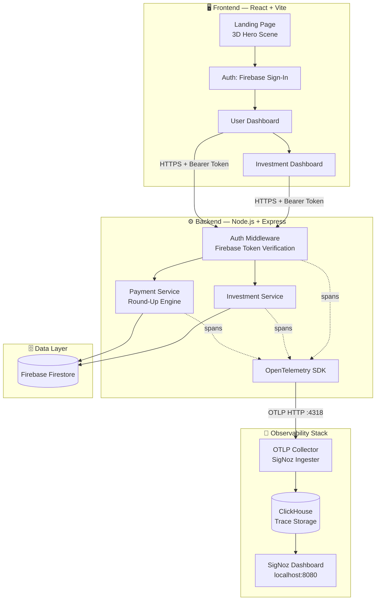
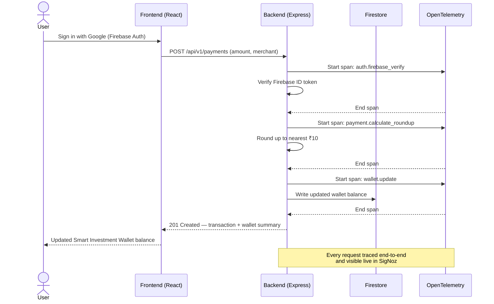
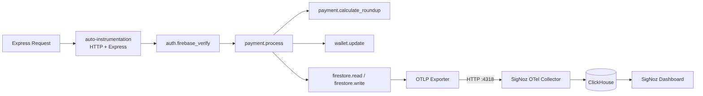

<div align="center">

# 💰 Bachat+

### Invest Every Spare Rupee. Automatically.

**An AI-assisted micro-investment platform that turns everyday UPI round-ups into long-term wealth — with production-grade observability baked in from day one.**

[](https://react.dev)
[](https://vitejs.dev)
[](https://nodejs.org)
[](https://expressjs.com)
[](https://firebase.google.com)
[](https://opentelemetry.io)
[](https://signoz.io)
[](https://tailwindcss.com)
[](#-license)

[Live Demo](https://baachat-plus.vercel.app) · [Report Bug](https://github.com/aryantiw06/baachat-plus/issues) · [Request Feature](https://github.com/aryantiw06/baachat-plus/issues)

</div>

---

## 🖼️ Preview

<div align="center">


*Landing page hero — round-up wealth platform pitch*


*User dashboard with Smart Investment Wallet overview*

</div>


</div>

---

## 📌 Table of Contents

- [Overview](#-overview)
- [Problem Statement](#-problem-statement)
- [Our Solution](#-our-solution)
- [Key Features](#-key-features)
- [Architecture](#-architecture)
- [User Flow](#-user-flow)
- [Tech Stack](#-tech-stack)
- [Folder Structure](#-folder-structure)
- [Getting Started](#-getting-started)
- [Environment Variables](#-environment-variables)
- [Running the Frontend](#-running-the-frontend)
- [Running the Backend](#-running-the-backend)
- [Observability: SigNoz + OpenTelemetry](#-observability-signoz--opentelemetry)
- [API Overview](#-api-overview)
- [Future Scope](#-future-scope)
- [Security Considerations](#-security-considerations)
- [Performance Optimizations](#-performance-optimizations)
- [Challenges Faced](#-challenges-faced)
- [What We Learned](#-what-we-learned)
- [Team](#-team)
- [Contributing](#-contributing)
- [License](#-license)
- [Acknowledgements](#-acknowledgements)
- [Contact](#-contact)

---

## 🎯 Overview

**Bachat+** ("Bachat" means *savings* in Hindi) is a micro-investment platform built around a simple insight: most people don't invest because they think it requires large sums of money. Bachat+ removes that barrier entirely.

Every time a user makes a UPI payment, the amount is automatically rounded up to the nearest ₹10. The spare change is instantly routed into a **Smart Investment Wallet**, where it compounds over time — turning loose change into a real investment habit, with zero manual effort.

> 🏆 Built with a production-style backend instrumented for real-time observability using OpenTelemetry and SigNoz — because a hackathon project shouldn't just *work*, it should be *monitorable*.

---

## ❓ Problem Statement

- Most first-time investors — students, early professionals — feel investing requires large, intimidating amounts of capital.
- Spare change from everyday digital payments (UPI) is functionally "lost" — it sits unused in bank balances instead of compounding.
- Existing investment apps require active decision-making for every transaction, creating friction that leads to inaction.

## 💡 Our Solution

Bachat+ automates the entire savings-to-investment pipeline:

1. **Round up** every UPI payment to the nearest ₹10.
2. **Isolate** the spare change automatically — no manual transfers.
3. **Route** it into a Smart Investment Wallet in real time.
4. **Compound** it over time into a real, trackable investment portfolio.

The result: investing becomes a passive byproduct of spending, not a separate financial decision.

---

## ✨ Key Features

| Feature | Status | Description |
|---|:---:|---|
| 🔐 Firebase Authentication | ✅ | Secure user auth via Firebase Auth |
| 🌐 Google Sign-In | ✅ | One-click OAuth login |
| 🎨 3D Interactive Landing Page | ✅ | WebGL hero scene with mouse-parallax phone mockup and floating coin animation |
| 📊 User Dashboard | ✅ | Central hub for wallet balance and activity |
| 💼 Smart Investment Wallet | ✅ | Real-time spare-change ledger |
| 🔄 Automatic Round-Up Engine | ✅ | Rounds every payment to nearest ₹10 |
| 💳 Payment Simulation | ✅ | Simulated UPI transactions for demo purposes |
| 📈 Portfolio Tracking | ✅ | Visualizes accumulated investments over time |
| 📉 Savings Analytics | ✅ | Breakdown of round-up savings behavior |
| 🎬 Framer Motion Animations | ✅ | Smooth, modern micro-interactions throughout the UI |
| 🛡️ Secure Backend APIs | ✅ | Express REST APIs behind Firebase-verified auth middleware |
| 🔭 Real-Time Observability | ✅ | Full distributed tracing via OpenTelemetry → SigNoz |

<details>
<summary><strong>💬 A note on accuracy</strong></summary>
<br>
This feature list reflects the current implementation state as of the latest commit. Items are marked accurately rather than aspirationally — anything still in progress is called out explicitly in <a href="#-future-scope">Future Scope</a> instead of being listed here as complete.
</details>

---

## 🏗️ Architecture



---

## 🔄 User Flow



---

## 🧰 Tech Stack

| Layer | Technology |
|---|---|
| **Frontend Framework** | React 19 |
| **Build Tool** | Vite |
| **Styling** | Tailwind CSS |
| **Animation** | Framer Motion |
| **3D / WebGL** | Three.js (landing page hero scene) |
| **Backend Runtime** | Node.js |
| **Backend Framework** | Express.js |
| **Database** | Firebase Firestore |
| **Authentication** | Firebase Authentication (Google Sign-In) |
| **Observability — Tracing SDK** | OpenTelemetry (`@opentelemetry/sdk-node`, auto-instrumentations) |
| **Observability — Backend** | SigNoz (self-hosted via Docker) |
| **Trace Storage** | ClickHouse |
| **Frontend Deployment** | Vercel |
| **Backend Deployment** | Render |
| **Version Control** | Git + GitHub |

---

## 📁 Folder Structure

```
baachat-plus/
├── bachat-frontend/
│   ├── src/
│   │   ├── pages/
│   │   │   └── Landing.jsx              # Public marketing landing page
│   │   ├── components/
│   │   │   └── landing_3d/
│   │   │       ├── Hero3DScene.jsx           # WebGL hero: 3D phone + coins
│   │   │       ├── RoundUpStorySimulator.jsx # 5-step round-up story animation
│   │   │       ├── HowItWorksSection.jsx     # 4-step engine explainer
│   │   │       ├── WhyBachatSection.jsx      # Core value pillars
│   │   │       ├── TechStackSection.jsx      # Tech showcase section
│   │   │       └── HackathonInnovationSection.jsx
│   │   └── ...                          # Dashboard, auth, wallet views
│   ├── .env                             # Frontend environment config
│   └── package.json
│
├── bachat-backend/
│   ├── src/
│   │   ├── config/
│   │   │   └── tracing.js               # OpenTelemetry SDK bootstrap
│   │   ├── utils/
│   │   │   └── tracer.js                # traceSpan() helper for custom spans
│   │   ├── middleware/
│   │   │   └── auth.middleware.js       # Firebase token verification
│   │   ├── services/
│   │   │   ├── payment.service.js       # Round-up calculation + wallet updates
│   │   │   └── investment.service.js    # Investment execution logic
│   │   └── server.js                    # Express entry point
│   ├── .env                             # Backend environment config (gitignored)
│   ├── .env.example                     # Safe template for required env vars
│   └── package.json
│
└── README.md
```

> ⚠️ `bachat-backend/.env` is intentionally excluded from version control. Use `.env.example` as a template.

---

## 🚀 Getting Started

### Prerequisites

| Tool | Version |
|---|---|
| Node.js | ≥ 18.x |
| npm | ≥ 9.x |
| Docker & Docker Compose | Latest (for local SigNoz) |
| Firebase Project | With Auth + Firestore enabled |

### Clone the Repository

```bash
git clone https://github.com/aryantiw06/baachat-plus.git
cd baachat-plus
```

---

## 🔑 Environment Variables

<details>
<summary><strong>bachat-backend/.env</strong></summary>

```env
PORT=5001
# ⚠️ Do not use port 5000 on macOS — it conflicts with the AirPlay Receiver
# (Control Center), which silently intercepts requests before they reach Express.

FIREBASE_PROJECT_ID=your-firebase-project-id
FIREBASE_CLIENT_EMAIL=your-service-account-email
FIREBASE_PRIVATE_KEY=your-service-account-private-key

OTEL_SERVICE_NAME=bachat-backend
OTEL_EXPORTER_OTLP_ENDPOINT=http://localhost:4318
```
</details>

<details>
<summary><strong>bachat-frontend/.env</strong></summary>

```env
VITE_FIREBASE_API_KEY=your-firebase-api-key
VITE_FIREBASE_AUTH_DOMAIN=your-project.firebaseapp.com
VITE_FIREBASE_PROJECT_ID=your-firebase-project-id
VITE_API_BASE_URL=http://localhost:5001
```
</details>

---

## 🎨 Running the Frontend

```bash
cd bachat-frontend
npm install
npm run dev
```

Frontend will be available at `http://localhost:5173` (default Vite port).

---

## ⚙️ Running the Backend

```bash
cd bachat-backend
npm install
npm run start
```

Backend will be available at `http://localhost:5001`.

> ℹ️ The server runs normally even without SigNoz active — tracing failures are caught gracefully and never block request handling.

---

## 🔭 Observability: SigNoz + OpenTelemetry

Bachat+ ships with **real distributed tracing**, not just logs. Every payment and investment request is traced end-to-end — HTTP layer, auth verification, business logic, and Firestore calls — and visualized live in SigNoz.

### Running SigNoz Locally

```bash
git clone -b main https://github.com/SigNoz/signoz.git
cd signoz/deploy/docker
docker compose up -d
```

SigNoz UI will be available at `http://localhost:8080`.

### OpenTelemetry Architecture



<details>
<summary><strong>📊 Example verified trace hierarchy (from real test run)</strong></summary>

```text
HTTP POST /api/v1/payments
 ├── auth.firebase_verify
 └── payment.process
      ├── firestore.read        (wallets)
      ├── payment.calculate_roundup   (amount=163 → roundUp=7)
      ├── wallet.update               (walletBalance=2007)
      ├── firestore.read        (analytics)
      └── firestore.write       (batch_commit)
```

**Verified via direct ClickHouse query:**
```sql
SELECT count() FROM signoz_traces.distributed_signoz_index_v3
WHERE serviceName = 'bachat-backend'
-- Result: 104 spans stored
```
</details>

> 📝 **Note:** SigNoz is self-hosted via Docker on the developer's machine. Traces are only visible while the local Docker stack is running — this is not a hosted/cloud dashboard.

---

## 🔌 API Overview

| Method | Endpoint | Description | Auth Required |
|---|---|---|:---:|
| `GET` | `/health` | Health check | ❌ |
| `POST` | `/api/v1/payments` | Simulate a payment, trigger round-up | ✅ |
| `GET` | `/api/v1/payments` | Fetch transaction history | ✅ |
| `POST` | `/api/v1/investments` | Execute an investment from wallet balance | ✅ |

<details>
<summary><strong>Example: POST /api/v1/payments</strong></summary>

**Request**
```json
{
  "amount": 163,
  "merchant": "Amazon",
  "category": "Shopping"
}
```

**Response — 201 Created**
```json
{
  "success": true,
  "transaction": {
    "id": "b210d397-59f5-4341-8857-75f8fc911dcb",
    "amount": 163,
    "roundUp": 7,
    "merchant": "Amazon",
    "category": "Shopping",
    "status": "completed"
  },
  "wallet": {
    "walletBalance": 7,
    "totalRoundups": 7,
    "totalTransactions": 1
  }
}
```
</details>

---

## 🔮 Future Scope

- [ ] Real UPI payment gateway integration (currently simulated)
- [ ] AI-powered investment advisor / recommendation engine
- [ ] Automated diversified portfolio allocation
- [ ] SigNoz Cloud migration for hosted, always-on observability
- [ ] Multi-currency and multi-bank support
- [ ] Push notifications for round-up milestones
- [ ] Mobile app (React Native)

---

## 🛡️ Security Considerations

- All protected API routes require a verified Firebase ID token via auth middleware.
- Firestore rules restrict document access to authenticated, resource-owning users.
- Backend `.env` secrets are excluded from version control via `.gitignore`.
- Tracing exporters fail gracefully — a missing or unreachable OTel collector never crashes or blocks the API.
- CORS is explicitly scoped to known frontend origins.

---

## ⚡ Performance Optimizations

- Vite-powered frontend build for fast dev server and optimized production bundles.
- 3D hero scene caps renderer pixel ratio (`Math.min(devicePixelRatio, 2)`) to avoid GPU strain on high-DPI displays.
- Reused geometry buffers across repeated 3D elements (coins) instead of duplicating meshes.
- OpenTelemetry batches and exports spans asynchronously — zero blocking impact on request latency.
- Firestore reads/writes are traced individually, enabling precise bottleneck identification (see `firestore.read` / `firestore.write` spans).

---

## 🧩 Challenges Faced

<details>
<summary><strong>1. Traces weren't reaching SigNoz — hours of silent failure</strong></summary>
<br>
The root cause turned out to be environmental, not code-related: macOS's AirPlay Receiver silently occupies port 5000 and intercepts HTTP requests before they reach Express. The backend was technically instrumented correctly the entire time — it just never received real traffic. Moving to port 5001 resolved it immediately, verified by a direct ClickHouse span count query rather than trusting local console logs alone.
</details>

<details>
<summary><strong>2. SigNoz Cloud was unavailable during the hackathon window</strong></summary>
<br>
With SigNoz Cloud login temporarily unavailable, the team pivoted to a fully self-hosted SigNoz deployment via Docker Compose — trading hosted convenience for full local control, which also made the OTel pipeline fully demoable offline.
</details>

<details>
<summary><strong>3. Initial 3D landing page visuals lacked depth</strong></summary>
<br>
The first WebGL hero implementation rendered flat, low-fidelity shapes instead of a convincing 3D scene. This is being addressed with proper extruded geometry, physical materials, and real scene lighting.
</details>

---

## 📚 What We Learned

- **Don't trust "success" logs blindly** — a `200 OK` or an SDK-started log doesn't confirm data reached its destination. Always verify at the source of truth (in this case, ClickHouse row counts).
- **Environment quirks matter as much as code** — an OS-level port conflict cost more debugging time than any actual application bug.
- **Observability isn't a "nice-to-have" bolt-on** — instrumenting early made every subsequent bug (including the port issue) diagnosable with hard data instead of guesswork.

---


## 🤝 Contributing

Contributions are welcome! To contribute:

1. Fork the repository
2. Create a feature branch (`git checkout -b feature/your-feature`)
3. Commit your changes (`git commit -m 'Add your feature'`)
4. Push to your branch (`git push origin feature/your-feature`)
5. Open a Pull Request

Please ensure any PR touching the backend does not break existing OpenTelemetry instrumentation.

---

## 📄 License

This project is licensed under the **MIT License** — see the [LICENSE](LICENSE) file for details.

---

## 🙏 Acknowledgements

- [SigNoz](https://signoz.io) — open-source observability platform
- [OpenTelemetry](https://opentelemetry.io) — vendor-neutral instrumentation standard
- [Firebase](https://firebase.google.com) — authentication and Firestore infrastructure
- [Framer Motion](https://www.framer.com/motion/) — animation library
- 

---

## 📬 Contact

**Aryan Raj Tiwary**
GitHub: [@aryantiw06](https://github.com/aryantiw06)

**Sruti Pandey**
GitHub: [@srus05](https://github.com/srus05)

Live Project: [baachat-plus.vercel.app](https://baachat-plus.vercel.app)

---

## ⭐ Star This Repository

If Bachat+ inspired you or helped you learn something, consider giving it a star — it helps the project reach more people.

[](https://star-history.com/#aryantiw06/baachat-plus&Date)

---

<div align="center">

**Built with ☕, ₹10 round-ups, and a lot of debugging at 5 AM.**

</div>
